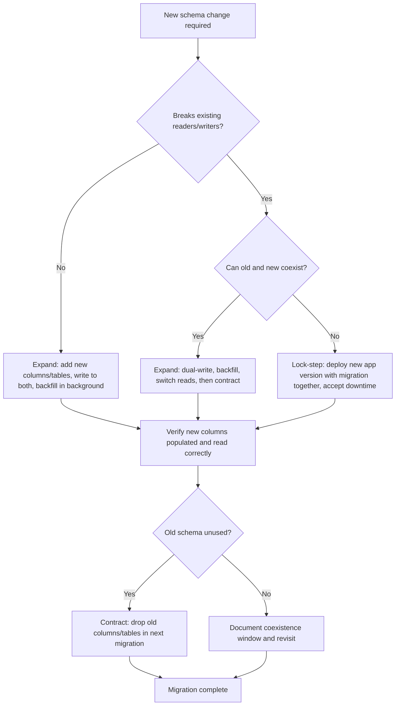

# Database Design

## Overview

Relational database design is the foundation on which query performance, data integrity, and long-term maintainability rest. This page covers the core decisions every developer should make before their first `CREATE TABLE`: how to structure tables, choose keys, enforce constraints, model relationships, index for query patterns, and evolve schemas safely over time.

## Normalisation

Normalisation is the process of organising data to minimise redundancy and avoid anomalies during insert, update, and delete operations. The goal is not to eliminate all redundancy — it is to eliminate *unnecessary* redundancy that creates update anomalies.

### First Normal Form (1NF)

A table is in 1NF when every column contains atomic (indivisible) values and there are no repeating groups. A column that stores a comma-separated list of values, or a JSON array when the DBMS does not support structured types, violates 1NF.

**Example — violation:**

```sql
CREATE TABLE orders_bad (
    order_id    INT PRIMARY KEY,
    customer    TEXT,          -- free text, no customer ID
    items       TEXT           -- "item1, item2, item3"
);
```

The `items` column holds a repeating group. Querying "all orders that contain product X" requires parsing the string, which is slow and error-prone.

### Second Normal Form (2NF)

A table is in 2NF when it is in 1NF and every non-key column depends on the *entire* primary key — not on part of a composite key. This matters when you have a composite primary key.

**Example — violation:**

```sql
CREATE TABLE order_items_bad (
    order_id  INT,
    product_id INT,
    quantity  INT,
    product_name TEXT,       -- depends only on product_id, not the full PK
    PRIMARY KEY (order_id, product_id)
);
```

`product_name` depends only on `product_id`, so it should move to a `products` table.

### Third Normal Form (3NF)

A table is in 3NF when it is in 2NF and every non-key column depends only on the primary key — not on another non-key column. "Every non-key column must tell a fact about the key, the whole key, and nothing but the key."

**Example — violation:**

```sql
CREATE TABLE orders_bad2 (
    order_id      INT PRIMARY KEY,
    customer_id   INT,
    customer_email TEXT        -- depends on customer_id, not order_id
);
```

`customer_email` depends on `customer_id`, so it belongs in a `customers` table.

### Worked Example — From Denormalised to 3NF

**Denormalised starting point:**

```sql
CREATE TABLE orders_denorm (
    order_id      INT,
    order_date    TIMESTAMP,
    customer_name TEXT,
    customer_email TEXT,
    product_sku   TEXT,
    product_name  TEXT,
    product_price DECIMAL(10,2),
    quantity      INT,
    line_total    DECIMAL(10,2)
);
```

Every order line repeats the customer name and email, and every line repeats the product name and price. Updating a customer's email requires touching every order row for that customer. Changing a product's price leaves historical lines at the wrong value (which may or may not be desired — see denormalisation below).

**Decomposed into 3NF:**

```sql
CREATE TABLE customers (
    customer_id  INT PRIMARY KEY,
    email        TEXT NOT NULL UNIQUE,
    name         TEXT NOT NULL,
    created_at   TIMESTAMP NOT NULL DEFAULT CURRENT_TIMESTAMP
);

CREATE TABLE products (
    product_id   INT PRIMARY KEY,
    sku          TEXT NOT NULL UNIQUE,
    name         TEXT NOT NULL,
    price        DECIMAL(10,2) NOT NULL CHECK (price > 0),
    stock_qty    INT NOT NULL DEFAULT 0 CHECK (stock_qty >= 0)
);

CREATE TABLE orders (
    order_id     INT PRIMARY KEY,
    customer_id  INT NOT NULL REFERENCES customers(customer_id),
    ordered_at   TIMESTAMP NOT NULL DEFAULT CURRENT_TIMESTAMP,
    status       TEXT NOT NULL DEFAULT 'pending' CHECK (status IN ('pending','shipped','delivered','cancelled'))
);

CREATE TABLE order_lines (
    order_line_id INT PRIMARY KEY,
    order_id      INT NOT NULL REFERENCES orders(order_id),
    product_id    INT NOT NULL REFERENCES products(product_id),
    quantity      INT NOT NULL CHECK (quantity > 0),
    unit_price    DECIMAL(10,2) NOT NULL CHECK (unit_price >= 0)
);
```

This schema eliminates update anomalies: a customer's email changes once in `customers`; a product's current price lives in `products`; each order line records the price *at time of purchase* in `unit_price`, preserving history without duplicating product data.

### When Denormalisation Is Acceptable

Normalization is not an absolute rule. Denormalisation is a deliberate trade-off that trades write complexity and storage for read performance. Acceptable cases:

- **Read-heavy reporting queries** where joins across many tables are the bottleneck and the data changes infrequently.
- **Snapshot/historical data** where the value at a point in time must be preserved (e.g. `unit_price` on an order line copied from the product at purchase time — this is not redundancy, it is a historical fact).
- **Materialised views or summary tables** that are rebuilt periodically, where query speed matters more than write cost.
- **High-scale OLTP systems** where join overhead is unacceptable and the application can manage consistency (e.g. storing a denormalised `customer_name` on an `orders` table for display purposes, with a background job to refresh it).

The key question: "What is the cost of inconsistency if this denormalised value drifts?" If the answer is "minor — we can rebuild it" then denormalisation is a reasonable optimisation. If the answer is "transactional integrity breaks" then stay normalised or use a materialised view with explicit refresh semantics.

## Keys

A key is a column or set of columns that uniquely identifies a row or establishes a relationship.

### Primary Key

A primary key uniquely identifies each row in a table. Every table should have one. It is implicitly `NOT NULL` and `UNIQUE`, and foreign keys reference it.

```sql
CREATE TABLE customers (
    customer_id INT PRIMARY KEY,
    ...
);
```

### Natural Key vs Surrogate Key

- **Natural key:** A key made from existing business data that is inherently unique — e.g. an email address, an ISO country code, a SKU.
- **Surrogate key:** An artificial identifier with no business meaning — typically an auto-incrementing integer or a UUID.

**Guideline:** Prefer surrogate keys (`INT` or `UUID`) for primary keys unless a natural key is small, stable, and universally unique. Natural keys that change (e.g. a user's email) create cascading update problems. Natural keys that are large (long strings) bloat every foreign key reference.

```sql
-- Surrogate key (preferred for most tables)
CREATE TABLE customers (
    customer_id INT GENERATED ALWAYS AS IDENTITY PRIMARY KEY,
    email TEXT NOT NULL UNIQUE,   -- natural key as a unique constraint, not the PK
    ...
);

-- Natural key as PK (acceptable when stable and compact)
CREATE TABLE iso_country_codes (
    code CHAR(2) PRIMARY KEY,    -- 'ZA', 'US', 'GB' — never changes
    name TEXT NOT NULL
);
```

### Composite Key

A composite key uses multiple columns together to form a unique identifier. Common in junction tables for many-to-many relationships.

```sql
CREATE TABLE order_lines (
    order_id  INT NOT NULL,
    product_id INT NOT NULL,
    quantity  INT NOT NULL,
    PRIMARY KEY (order_id, product_id)   -- composite PK
);
```

Use a composite key when the natural identity of a row is the combination of two or more foreign keys. For a pure junction table, a composite PK of the two FK columns is clean and prevents duplicate pairs.

### Foreign Key

A foreign key enforces referential integrity: a value in one table must exist in the referenced table's primary key (or unique key).

```sql
CREATE TABLE orders (
    order_id     INT PRIMARY KEY,
    customer_id  INT NOT NULL,
    ...
    CONSTRAINT fk_orders_customer
        FOREIGN KEY (customer_id) REFERENCES customers(customer_id)
        ON DELETE RESTRICT    -- prevent deleting a customer with existing orders
);
```

**`ON DELETE` options:**

| Action | Effect |
|--------|--------|
| `RESTRICT` / `NO ACTION` | Rejects the delete if referencing rows exist (default in most DBMS) |
| `CASCADE` | Deletes referencing rows automatically — use with extreme caution |
| `SET NULL` | Sets the FK column to NULL — only valid if the column is nullable |
| `SET DEFAULT` | Sets the FK column to its default value |

Prefer `RESTRICT` for most business relationships. `CASCADE` is appropriate for true ownership (e.g. deleting a blog post deletes its comments) but dangerous on business-critical relationships.

## Constraints

Constraints are the database's last line of defence for data integrity. They run closer to the data than application code and cannot be bypassed by a bug in the application layer.

### NOT NULL

A `NOT NULL` constraint prevents missing data. Default to `NOT NULL` for every column unless there is a specific reason to allow NULL.

```sql
CREATE TABLE users (
    user_id   INT PRIMARY KEY,
    email     TEXT NOT NULL,       -- every user must have an email
    phone     TEXT                 -- optional — some users may not have a phone
);
```

### UNIQUE

A `UNIQUE` constraint ensures no two rows have the same value in a column or column set. It allows NULL (in most DBMS, NULL is not equal to NULL, so multiple NULLs are allowed — check your DBMS documentation).

```sql
CREATE TABLE customers (
    customer_id INT PRIMARY KEY,
    email TEXT NOT NULL UNIQUE,    -- one account per email address
    ...
);
```

### CHECK

A `CHECK` constraint enforces a predicate on a single row. It is evaluated on every insert and update.

```sql
CREATE TABLE products (
    product_id INT PRIMARY KEY,
    price      DECIMAL(10,2) NOT NULL CHECK (price > 0),
    status     TEXT NOT NULL CHECK (status IN ('active','discontinued')),
    stock_qty  INT NOT NULL CHECK (stock_qty >= 0)
);
```

CHECK constraints are excellent for domain rules that must never be violated, regardless of which application or script writes to the database. Examples:

- `CHECK (price > 0)` — negative prices are always wrong.
- `CHECK (status IN ('pending','shipped','delivered'))` — prevents typos and invalid states.
- `CHECK (start_date < end_date)` — enforces temporal ordering.
- `CHECK (age >= 18)` — enforces a business rule at the data layer.

### Application-Level Validation vs Database-Enforced Invariants

Both are necessary and serve different purposes:

| Aspect | Application Validation | Database Constraint |
|--------|----------------------|---------------------|
| **Purpose** | User experience, early feedback, input sanitisation | Final safety net, integrity guarantee |
| **Can be bypassed?** | Yes — direct DB access, another microservice, a script | No — the DBMS enforces it for all writers |
| **Error detail** | Rich, contextual, i18n-aware | Generic SQL error — must be caught and translated |
| **Cost** | Runs in application process, easy to test | Runs in DBMS, adds write overhead (usually negligible) |

**Rule of thumb:** Validate in the application for user experience AND enforce in the database for integrity. A `CHECK (price > 0)` constraint is cheap insurance against a bug in the application or a direct SQL edit. Do not rely on application validation alone — it is not a substitute for database constraints when data integrity matters.

## Cardinality

Cardinality describes the number of related rows between two entities. Getting cardinality right determines your foreign key placement and junction table design.

### One-to-One (1:1)

One row in table A relates to at most one row in table B, and vice versa. Implemented by placing a unique foreign key on either side.

```sql
CREATE TABLE users (
    user_id    INT PRIMARY KEY,
    email      TEXT NOT NULL UNIQUE,
    ...
);

CREATE TABLE user_profiles (
    profile_id INT PRIMARY KEY,
    user_id    INT NOT NULL UNIQUE REFERENCES users(user_id),
    bio        TEXT,
    avatar_url TEXT
);
```

The `UNIQUE` constraint on `user_profiles.user_id` enforces the "one profile per user" rule. Common 1:1 use cases: splitting a wide table for performance, storing optional profile data separately, or table partitioning by nature (e.g. `employees` and `employee_contracts` where each employee has exactly one contract).

### One-to-Many (1:N)

One row in table A relates to zero or more rows in table B. The foreign key goes on the "many" side.

```sql
CREATE TABLE customers (
    customer_id INT PRIMARY KEY,
    name        TEXT NOT NULL
);

CREATE TABLE orders (
    order_id    INT PRIMARY KEY,
    customer_id INT NOT NULL REFERENCES customers(customer_id),
    ordered_at  TIMESTAMP NOT NULL
);
```

One customer can have many orders; each order belongs to exactly one customer. This is the most common relationship pattern.

### Many-to-Many (M:N)

Many rows in table A relate to many rows in table B. Requires a junction (bridge/join) table with foreign keys to both sides.

```sql
CREATE TABLE students (
    student_id INT PRIMARY KEY,
    name       TEXT NOT NULL
);

CREATE TABLE courses (
    course_id INT PRIMARY KEY,
    title      TEXT NOT NULL
);

CREATE TABLE enrollments (
    student_id INT NOT NULL REFERENCES students(student_id),
    course_id  INT NOT NULL REFERENCES courses(course_id),
    enrolled_at TIMESTAMP NOT NULL DEFAULT CURRENT_TIMESTAMP,
    grade      TEXT CHECK (grade IS NULL OR grade IN ('A','B','C','D','F')),
    PRIMARY KEY (student_id, course_id)   -- prevents duplicate enrollment
);
```

A student can enrol in many courses; a course can have many students. The `enrollments` junction table resolves the M:N relationship. Use a composite primary key on the two foreign keys to prevent duplicate pairs.

## Auditing and Soft Delete

### Auditing Columns

Audit columns track who created or modified a row and when. They are invaluable for debugging, compliance, and operational visibility.

```sql
CREATE TABLE customers (
    customer_id INT PRIMARY KEY,
    email       TEXT NOT NULL UNIQUE,
    name        TEXT NOT NULL,
    created_at  TIMESTAMP NOT NULL DEFAULT CURRENT_TIMESTAMP,
    updated_at  TIMESTAMP NOT NULL DEFAULT CURRENT_TIMESTAMP,
    created_by  TEXT NOT NULL,              -- application user or service account
    version     INT NOT NULL DEFAULT 1      -- optimistic locking version
);
```

**Column guidance:**

| Column | Purpose | Notes |
|--------|---------|-------|
| `created_at` | When the row was inserted | Set by `DEFAULT CURRENT_TIMESTAMP`; never updated |
| `updated_at` | When the row was last modified | Updated by application or trigger on every write |
| `created_by` | Who created the row | Application user ID, service account, or auth token subject |
| `version` | Optimistic locking | Incremented on each update; used to detect concurrent modifications |

For `updated_at`, use a trigger if you want the database to manage it automatically:

```sql
CREATE OR REPLACE FUNCTION update_updated_at_column()
RETURNS TRIGGER AS $$
BEGIN
    NEW.updated_at = CURRENT_TIMESTAMP;
    RETURN NEW;
END;
$$ LANGUAGE plpgsql;

CREATE TRIGGER set_updated_at
    BEFORE UPDATE ON customers
    FOR EACH ROW
    EXECUTE FUNCTION update_updated_at_column();
```

`version` supports optimistic locking: the application reads the current version, and on update includes `WHERE version = <read_value>`; if zero rows are updated, another process modified the row concurrently.

### Soft Delete vs Hard Delete

**Hard delete** removes the row permanently. It is simple, enforces referential integrity naturally (cascading or restricted), and keeps the table size small.

**Soft delete** marks a row as deleted without removing it, typically with a `deleted_at` column:

```sql
CREATE TABLE customers (
    customer_id INT PRIMARY KEY,
    email       TEXT NOT NULL,
    name        TEXT NOT NULL,
    deleted_at  TIMESTAMP       -- NULL = active; set to a timestamp when deleted
);
```

Queries must remember to filter: `WHERE deleted_at IS NULL`.

**Trade-offs:**

| Aspect | Soft Delete | Hard Delete |
|--------|------------|-------------|
| **Recovery** | Easy — clear `deleted_at` | Requires backup restore |
| **Referential integrity** | FK references still work (the row exists) | May cascade or be restricted; orphan risk if not careful |
| **Unique constraints** | A unique constraint on `email` prevents re-adding a soft-deleted email — use a partial unique index: `CREATE UNIQUE INDEX ON customers (email) WHERE deleted_at IS NULL` | No issue — row is gone |
| **Table size** | Grows unbounded unless archived | Stays smaller |
| **Query complexity** | Every query needs `WHERE deleted_at IS NULL` unless using views | No filter needed |
| **Audit trail** | Preserved — good for compliance | Lost unless separately logged |

**Guideline:** Use soft delete when you need an audit trail, the ability to undo deletions, or regulatory retention requirements. Use hard delete when the data is genuinely transient and has no downstream dependencies. If you soft-delete, always use a partial unique index so that soft-deleted values do not block re-creation, and consider an archival strategy to keep active tables small.

## Indexing

Indexes are data structures that speed up read queries at the cost of additional storage and slower writes. The goal is not to index everything — it is to index the right columns based on actual query patterns.

### Which Columns to Index

- **Foreign key columns:** Almost always index FK columns. Joins and cascade checks use them, and unindexed FKs can cause full-table scans on parent deletes.
- **Columns in WHERE clauses:** Especially equality predicates (`WHERE status = 'shipped'`) and range predicates (`WHERE ordered_at > '2025-01-01'`).
- **Columns in ORDER BY and GROUP BY:** Indexes can avoid a sort step.
- **Columns in JOIN conditions:** The join column on both sides should be indexed.
- **High-selectivity columns:** Columns with many distinct values relative to row count are better index candidates than low-cardinality columns.

### Which Columns NOT to Index

- **Low-cardinality columns used alone:** A `BOOLEAN` or `status` column with 3 distinct values across millions of rows is rarely worth a standalone index unless combined in a composite index that makes it selective.
- **Small tables:** A full table scan on a 100-row table is often faster than an index lookup plus random I/O.
- **Columns updated constantly:** Every index on a frequently-updated column adds write overhead.
- **Columns never used in queries:** Indexes cost storage and write time — do not index columns "just in case."

### Composite Index Column Order

A composite index on `(A, B, C)` can be used for queries that filter on A alone, A and B, or A, B, and C — but NOT for queries that filter on B alone or C alone. The leftmost prefix rule matters.

**Guideline:** Put the most selective column first (the one that filters out the most rows), followed by columns used for sorting or additional filtering. Equality columns before range columns.

```sql
-- Query: WHERE customer_id = ? AND ordered_at > ?
-- Index: (customer_id, ordered_at) — customer_id is equality, ordered_at is range
CREATE INDEX idx_orders_customer_date ON orders (customer_id, ordered_at);
```

If the query filters on `ordered_at` alone, this index does not help — you would need a separate index on `ordered_at`.

### Covering Indexes

A covering index includes all columns a query needs, so the DBMS can satisfy the query from the index alone without reading the table heap. This is the fastest possible read path.

```sql
-- Query: SELECT customer_id, email FROM customers WHERE email = ?
-- Covering index: includes the selected columns
CREATE INDEX idx_customers_email_covering ON customers (email, customer_id);
```

The `email` column is the filter; `customer_id` is included so the index covers the SELECT list. The DBMS does not need to visit the table.

### Index Maintenance

- Review index usage periodically — many databases expose `pg_stat_user_indexes` (PostgreSQL) or equivalent to show which indexes are actually used.
- Drop unused indexes: they cost write performance and storage.
- Be aware of index bloat after heavy update/delete cycles; REINDEX periodically if needed.

## Schema Evolution

Changing a database schema in a running application is one of the highest-risk operations in software delivery. A migration that locks tables, breaks running queries, or leaves the application and database out of sync can cause outages. The expand/contract pattern is the safest general approach.

### The Expand/Contract Pattern

The core idea: never change a schema in a way that breaks the currently-deployed application. Instead, expand the schema first (add new structures, write to both), then contract (remove old structures) in a separate, later deployment.

**Phase 1 — Expand:**

1. Add new columns or tables. Make them nullable or with a default so existing writes do not fail.
2. Deploy application code that writes to both the old and new structures (dual-write), or writes only to the new structure if it is backward-compatible.
3. Backfill existing data into the new structure in the background, in batches, without locking the table.
4. Verify that new columns are populated and readable.

**Phase 2 — Switch:**

1. Deploy application code that reads from the new structure (and still writes to both, or writes only to the new structure).
2. Monitor for errors, performance regressions, and data discrepancies.
3. Once confident, remove dual-writes from the application.

**Phase 3 — Contract:**

1. In a later deployment, drop the old columns or tables that are no longer used.
2. Verify the system is stable with the old structures removed.

### When to Use Lock-Step Migrations

Lock-step (deploy migration + new application version together, accept downtime) is acceptable when:

- The application can be stopped (scheduled maintenance window).
- The data set is small enough that the migration completes quickly.
- There is no zero-downtime requirement.
- The migration is truly breaking and cannot be made backward-compatible (e.g. changing a column type in a way that existing readers cannot handle, with no expand/contract path).

For most production systems with live traffic, expand/contract is preferred because it avoids downtime and reduces risk.

### Data Backfills

Backfills copy existing data into new columns or tables. Key principles:

- **Batch the work:** Process rows in small batches (e.g. 1000–10000 rows per transaction) to avoid long-running transactions that lock tables or fill transaction logs.
- **Throttle if needed:** Add pauses or rate limits if the backfill competes with production workload.
- **Make it resumable:** Track progress (e.g. a high-water mark on an ordered column) so the backfill can resume after an interruption.
- **Validate after:** After the backfill, run consistency checks — row counts, checksums, sample comparisons — to ensure the new structure matches the old.

### Rollback Criteria

Before running any migration, define what "rollback" means:

- **Backward-compatible migration (expand phase):** Rollback usually means deploying the previous application version. The new columns exist but are unused — no harm.
- **Breaking migration (contract phase):** Rollback may require re-adding dropped columns or restoring from backup. This is why contract phases are separated from expand phases by days or weeks of observation.
- **Failed migration:** If a migration fails mid-way, can you safely retry? Use idempotent migration scripts where possible (e.g. `CREATE TABLE IF NOT EXISTS`, `ALTER TABLE ... ADD COLUMN IF NOT EXISTS`).

### Migration Decision Flow

Not every schema change needs the full expand/contract cycle. Use the decision diagram below to choose the right strategy:



The diagram above is in [`normalised-order-example.mmd`](../../diagrams/database-design/normalised-order-example.mmd) and [`migration-decision-flow.mmd`](../../diagrams/database-design/migration-decision-flow.mmd).

### Application Version and Database Version Coupling

A robust deployment pipeline couples application and database versions carefully:

- The database migration should be applied *before* the new application code starts serving traffic (for expand phases).
- The new application code must be able to run against both the old and new schema during the coexistence window.
- The old application code must be able to run against the new schema (this is the "backward-compatible" requirement — new columns are additive, not renaming or removing existing ones).

## ER Diagram — Normalised Order Example

The Mermaid ER diagram below shows the decomposed order schema from the normalisation worked example:

```mermaid
--8<-- "programming/diagrams/database-design/normalised-order-example.mmd"
```

## Migration Decision Flow Diagram

The migration strategy decision flowchart:

```mermaid
--8<-- "programming/diagrams/database-design/migration-decision-flow.mmd"
```

## See Also

- [Persistence](../persistence/persistence.md) — JDBC, JPA, and ORM trade-offs at the Java API level.
