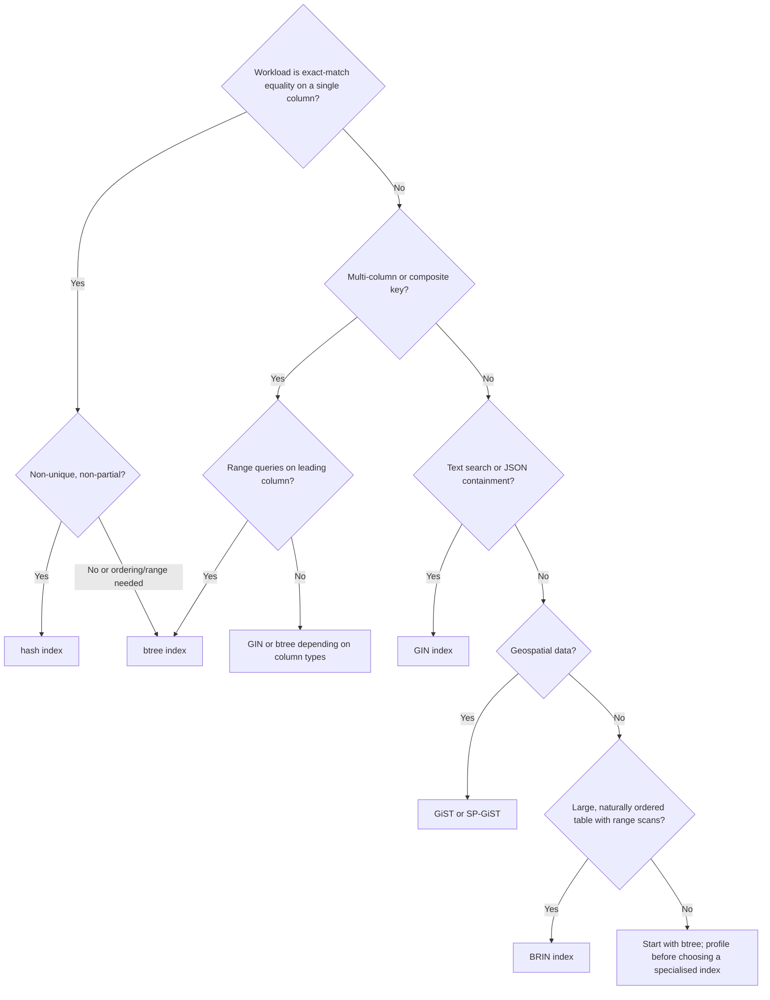
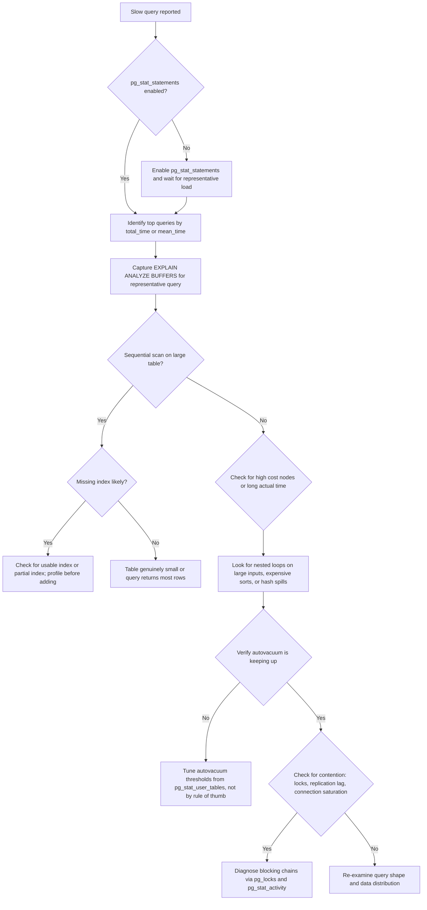

# POSTGRESQL OPERATIONS & PERFORMANCE

> **Version applicability:** This page targets PostgreSQL 14–17. Where a feature is
> version-sensitive, the relevant version is noted inline. BRIN indexes, for example,
> are available from PostgreSQL 10 onward; logical replication improvements and
> `pg_stat_statements` tracking of planning time were introduced in later releases.
> Always confirm feature availability against the minor version you run in production.

## Index Types

PostgreSQL ships with several index methods, each suited to different access patterns.
Choosing the right index type is a measurement-driven decision — start with `btree`
(the default) and profile before reaching for a specialised index.

|| Index Type | Best For | Limitations | Version Note |
|-----------|---------|-----------|--------------|-------------|
| `btree` | Equality and range queries on scalar columns; default index type | Not ideal for full-text search or JSON containment | Available in all supported versions |
| `hash` | Exact-match equality on a single column | No support for range queries or ordering; historically less robust than `btree` | Available in all supported versions |
| `gin` | Full-text search, JSON containment (`@>`), array overlap (`&&`), composite values | Higher write overhead; larger index size | Available in all supported versions |
| `gist` | Geospatial data (PostGIS), geometric types, full-text search (alternative to GIN) | Larger and slower to maintain than `btree` for simple scalar columns | Available in all supported versions |
| `brin` | Large, naturally ordered tables where range scans target contiguous physical ranges | Only useful when data correlation with physical storage is high; not a general-purpose index | Available from PostgreSQL 10 onward |
| `spgist` | Partitioned GiST; useful for non-balanced data structures such as quad-trees, radix trees, and text search with custom strategies | Niche use cases; requires understanding of the underlying partitioning strategy | Available in all supported versions |



## Query Plans and EXPLAIN

`EXPLAIN (ANALYZE, BUFFERS)` executes the statement and returns both the planner's
estimates and the actual runtime metrics. Use it to understand where time is spent
and whether the planner's cardinality estimates match reality.

- **Sequential scan:** Reads the whole table. Expected for small tables or queries
  that return a large fraction of rows, but a red flag on large tables with selective predicates.
- **Index scan:** Traverses an index to locate individual rows. Preferred for selective
  queries on indexed columns.
- **Bitmap scan:** Combines multiple index results into a bitmap before visiting the heap.
  Useful when a query matches many rows through an index but not enough to make a pure
  index scan cheaper.

Cost vs actual time: the planner's *cost* is a unitless estimate; *actual time* is in
milliseconds. When actual time diverges sharply from estimated cost, check for stale
statistics (`ANALYZE`) or data skew that the planner cannot model.

Safe SQL example:

```sql
EXPLAIN (ANALYZE, BUFFERS, FORMAT TEXT)
SELECT * FROM orders
WHERE customer_id = 42
  AND created_at > '2025-01-01';
```

Example `EXPLAIN` output (abbreviated):

|| Node | Actual Time | Rows | Buffers |
|-----------|---------|-----------|------|---------|
| Seq Scan on orders | 12.30..345.60 | 142 | shared hit=312 read=4012 |
| Index Scan using idx_orders_customer_id | 0.08..1.20 | 142 | shared hit=340 |

The table above shows a case where an index scan replaces a sequential scan and reduces
buffer reads. Measurement from `pg_stat_user_tables` and `pg_stat_database` drives the
decision to add or adjust an index — not a blanket rule.

## VACUUM and Autovacuum

PostgreSQL uses MVCC: updated and deleted rows leave behind dead tuples that `VACUUM`
reclaims. Without vacuuming, tables bloat and transaction ID wraparound risk grows.

- **`VACUUM` (regular):** Reclaims dead tuple space for reuse within the same table.
  Does not return space to the OS. Can run concurrently with other operations.
- **`VACUUM FULL`:** Rebuilds the table and returns space to the OS. Requires an
  `ACCESS EXCLUSIVE` lock — avoid on busy tables without a maintenance window.

Autovacuum thresholds and scale factors (defaults shown for reference — adjust based on
measured table activity, not by rule of thumb):

|| Parameter | Default | Meaning |
|-----------|---------|---------|
| `autovacuum_vacuum_threshold` | 50 | Minimum number of dead tuples before autovacuum considers a table |
| `autovacuum_vacuum_scale_factor` | 0.2 | Fraction of table rows above the threshold that triggers vacuuming |
| `autovacuum_vacuum_insert_threshold` | 100 | Threshold for insert-triggered vacuum (PostgreSQL 13+) |
| `autovacuum_vacuum_insert_scale_factor` | 0.2 | Scale factor for insert-triggered vacuum |

Check transaction ID wraparound risk with:

```sql
SELECT datname, age(datfrozenxid) AS xid_age
FROM pg_database
ORDER BY xid_age DESC;
```

A high `xid_age` relative to 2^31 indicates the database is approaching wraparound and
needs urgent vacuuming.

Read vacuum activity from `pg_stat_user_tables`:

```sql
SELECT relname, n_dead_tup, last_vacuum, last_autovacuum,
       n_live_tup, last_autovacuum
FROM pg_stat_user_tables
ORDER BY n_dead_tup DESC;
```

Tuning must be measurement-driven: observe dead tuple accumulation rates from
`pg_stat_user_tables` and overall vacuum load from `pg_stat_database`, then adjust
thresholds and scale factors per table workload. There is no universal numeric setting
that fits every table.

## Locks

PostgreSQL acquires locks at multiple granularity levels. The table below lists the
common table-level lock types and example operations that acquire them.

|| Lock Type | Example Operations |
|-----------|---------------|
| `ACCESS SHARE` | `SELECT` |
| `ROW SHARE` | `SELECT ... FOR UPDATE`, `SELECT ... FOR SHARE` |
| `ROW EXCLUSIVE` | `INSERT`, `UPDATE`, `DELETE` |
| `SHARE UPDATE EXCLUSIVE` | `VACUUM` (non-FULL), `ANALYZE`, `CREATE INDEX CONCURRENTLY` |
| `SHARE` | `CREATE INDEX` (non-concurrent) |
| `SHARE ROW EXCLUSIVE` | `CREATE TRIGGER`, `ALTER TABLE ... ADD COLUMN` (some variants) |
| `EXCLUSIVE` | `REFRESH MATERIALIZED VIEW` (non-concurrent) |
| `ACCESS EXCLUSIVE` | `VACUUM FULL`, `DROP TABLE`, `ALTER TABLE ... DROP COLUMN`, most `ALTER TABLE` forms |

Inspect blocking chains with:

```sql
SELECT l1.pid AS blocker_pid,
       l1.granted,
       l2.pid AS blocked_pid,
       l2.mode,
       l2.granted
FROM pg_locks l1
JOIN pg_locks l2 ON l1.pid != l2.pid
  AND l1.locktype = l2.locktype
  AND l1.database IS NOT DISTINCT FROM l2.database
  AND l1.relation IS NOT DISTINCT FROM l2.relation
  AND l1.page IS NOT DISTINCT FROM l2.page
  AND l1.tuple IS NOT DISTINCT FROM l2.tuple
  AND l1.virtualxid IS NOT DISTINCT FROM l2.virtualxid
  AND l1.transactionid IS NOT DISTINCT FROM l2.transactionid
  AND l1.classid IS NOT DISTINCT FROM l2.classid
  AND l1.objid IS NOT DISTINCT FROM l2.objid
  AND l1.objsubid IS NOT DISTINCT FROM l2.objsubid
WHERE NOT l1.granted
  AND l2.granted;
```

Correlate with `pg_stat_activity` to see what each session is doing:

```sql
SELECT pid, now() - pg_stat_activity.query_start AS duration, query, state,
       wait_event_type, wait_event
FROM pg_stat_activity
WHERE pid IN (<blocker_pid>, <blocked_pid>)
ORDER BY duration DESC;
```

## Backup and Point-in-Time Recovery

PostgreSQL supports two broad backup strategies, which can be combined for PITR.

- **Logical dump (`pg_dump` / `pg_restore`):** Dumps a database as SQL or custom-format
  archive. Suitable for small to medium databases, cross-version migrations, and subsets
  of a cluster. Custom format (`-Fc`) enables parallel restore with `pg_restore -j`.
- **Physical backup (`pg_basebackup`):** Copies the raw cluster directory. Required for
  PITR when combined with WAL archiving. Streamed over the replication protocol.

WAL archiving basics: configure `archive_mode = on`, set `archive_command` to copy WAL
segments to a safe location, and ensure `archive_timeout` is reasonable so that WAL is
switched frequently enough for fine-grained recovery points.

Point-in-time recovery (PITR) concept: restore a physical base backup, then replay WAL
up to a target timestamp or transaction ID. The recovery target is set in `recovery.conf`
(PostgreSQL 11 and earlier) or in `postgresql.conf`/`standby.signal` (PostgreSQL 12+).

Restore to a target timestamp (conceptual steps):

1. Stop the server and replace the data directory with the base backup.
2. Configure `restore_command` to fetch archived WAL.
3. Set `recovery_target_time` to the desired point.
4. Start the server — it replays WAL until the target and then stops (or continues if
   `recovery_target_action` is set otherwise).

Version applicability: `pg_basebackup` and WAL archiving have been available for many
versions; the configuration mechanism changed in PostgreSQL 12 with the removal of
`recovery.conf` in favour of `postgresql.conf` settings and signal files. Always verify
the procedure against the minor version in production.

## Replication

|| Replication Type | Description | Use Cases | Limitations / Trade-offs |
|-----------|-------------|-----------|------------------------|
| Physical (streaming) — asynchronous | Standby replays WAL asynchronously; primary does not wait for standby acknowledgement | HA with automatic failover, read replicas | Standby can fall behind; data loss possible if primary fails before replication catches up |
| Physical (streaming) — synchronous | Primary waits for at least one synchronous standby to acknowledge WAL before committing | Zero-data-loss HA for critical workloads | Increased write latency; availability depends on synchronous standby being reachable |
| Logical replication | Replicates individual table changes (INSERT/UPDATE/DELETE) to subscribers | Selective replication, cross-version upgrades, reporting copies, multi-master-like topologies (with care) | Requires primary keys on replicated tables; schema changes must be managed; not a drop-in HA replacement for physical replication |

Synchronous replication trade-offs (latency, availability) are workload-dependent.
A synchronous standby that is geographically distant can add noticeable commit latency.
If the synchronous standby is unreachable, the primary blocks commits unless
`synchronous_standby_names` is configured to allow fallback or the setting is reduced.
Measure commit latency and failover behaviour under representative load before choosing
synchronous replication for a production workload.

## Connection Pooling

PostgreSQL's `max_connections` is a fixed cluster-level limit. Connection pooling reduces
the number of direct connections the server must maintain while presenting many application
connections.

|| Pool Implementation | Modes / Features | When to Use |
|-----------|-------------|-----------|
| `pgbouncer` | Transaction pooling (connection reused per transaction), session pooling (connection reused per session), statement pooling | High-concurrency applications where each client holds a short-lived connection; the most common choice for pooling PostgreSQL |
| `pgpool-II` | Connection pooling plus additional features: replication management, load balancing, parallel query (in some configurations) | Environments that want pooling combined with replication management or load balancing across multiple servers |
| Application-side pooling | Drivers and frameworks (e.g., HikariCP, PgBouncer-like patterns in-process) | Simpler deployments where a separate pooler is not desired; pool sizing must still respect `max_connections` and application concurrency |

Pool sizing must be measured against application concurrency and PostgreSQL `max_connections`.
A pooler does not increase the server's capacity for concurrent active queries — it reduces
the connection overhead. If the pool size is too small, applications wait for connections;
if `max_connections` is too low relative to peak demand, the server rejects connections.
Profile connection wait times and server connection utilization before sizing pools.

## Slow Query Troubleshooting

A measurement-driven workflow for slow queries:

1. **Enable `pg_stat_statements`** (load the extension and ensure `shared_preload_libraries`
   includes `pg_stat_statements`). This extension tracks execution statistics across all
   queries. In later PostgreSQL versions it also tracks planning time.
2. **Correlate with `pg_stat_activity`** to see currently running queries, their state,
   and how long they have been active.
3. **Capture `EXPLAIN (ANALYZE, BUFFERS)`** for the representative slow query — not a
   generic plan, but the plan for the actual parameters and data distribution.
4. **Check for missing indexes or costly sequential scans on large tables.** A sequential
   scan on a large table that returns few rows is a strong indicator that an index is
   missing or not being used.
5. **Verify autovacuum is keeping up.** If dead tuples accumulate, the planner may choose
   poor plans and scan bloated tables.
6. **Recheck.** After any change, re-run the query under representative conditions and
   compare before/after metrics.



## Migration and Rollback Planning

Safe operational examples for DDL and migrations:

- **Dump before migration.** Take a logical dump (`pg_dump -Fc`) or confirm a recent
  physical backup exists before running schema changes on a production database.
- **Test restore on a staging instance.** Restore the pre-migration dump to a staging
  database, apply the migration there, and verify the result before touching production.
- **Run DDL in a transaction where possible.** Many DDL statements can run inside a
  transaction block (`BEGIN; ... COMMIT;`). If the migration fails mid-way, the
  transaction rolls back and the database remains consistent.
- **Plan a rollback path.** Know how to revert the migration file (reverse DDL) and how
  to restore from the pre-migration base backup or logical dump if a forward migration
  fails irrecoverably.
- **Avoid long-running DDL that acquires `ACCESS EXCLUSIVE` locks on busy tables.**
  Operations such as `VACUUM FULL`, `DROP COLUMN`, or certain `ALTER TABLE` variants
  hold `ACCESS EXCLUSIVE` locks that block all other access to the table. Schedule such
  operations during a maintenance window and verify the expected lock duration on a
  staging copy first.

## Cross-References

- [AWS Database](../../../aws/files/database/database.md) — RDS and Aurora PostgreSQL as managed
  PostgreSQL hosting options, including Multi-AZ, read replicas, and Aurora Global Database.
- [Azure Storage](../../../azure/files/storage/storage.md) — Azure Database for PostgreSQL Flexible
  Server, including Burstable, General Purpose, and Memory Optimized compute tiers.
